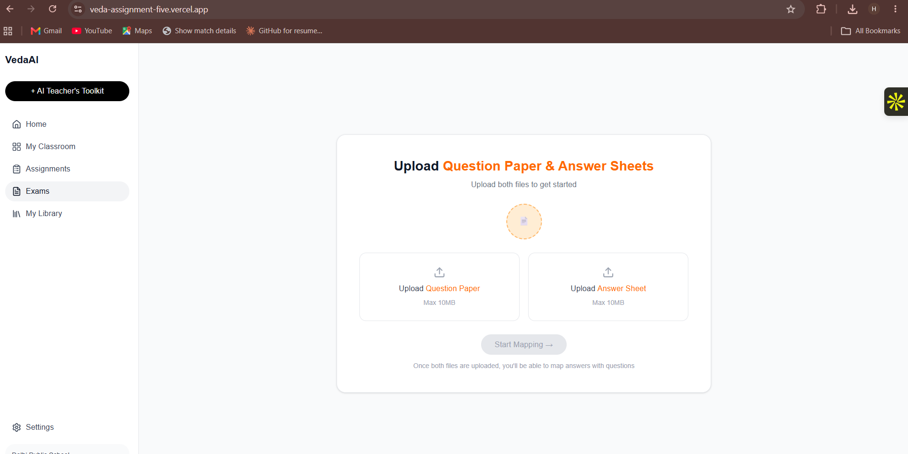
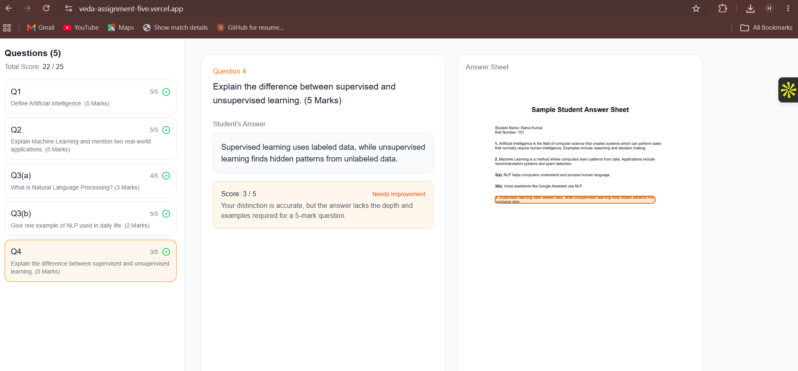

# VedaAI Hiring Assignment — AI Assessment Extraction & Answer Mapping

**Live URL:** https://veda-assignment-five.vercel.app
**GitHub:** [add your repo URL here]

A web app that lets a teacher upload a question paper and a student's handwritten answer sheet, automatically extracts and matches questions to answers, highlights the exact answer region on the sheet, and grades each answer with AI feedback.

---

## Features

- Upload question paper and answer sheet (PDF or image) with real upload progress
- Extracts every question in printed order, preserving numbering — labelled sub-parts (e.g. `11(a)`, `11(b)`) are treated as separate entries
- Extracts every handwritten answer block from the answer sheet
- Matches answers to questions by label, correctly handling:
  - Questions answered out of order
  - Unanswered questions (flagged clearly, not dropped)
  - Answers that don't match any question (shown separately, not discarded)
- Highlights the **exact region** of the matched answer directly on the rendered answer sheet
- AI grading layer: per-question score, correct/incorrect verdict, short feedback, and an overall total score

---

## Screenshots

### Upload screen
Teacher uploads the question paper and answer sheet, matching the provided Figma design.



### Question mapping, highlighted answer region, and AI grading
Clicking a question shows its matched answer, highlights the exact region on the answer sheet image, and displays a per-question AI score with feedback plus the running total.



---

## Approach

The app splits the problem into four independent stages: question extraction, answer extraction, matching, and grading. Keeping these separate made each stage easier to test and debug on its own, and made the trickier edge cases (sub-parts, unanswered questions, unmatched answers) straightforward to handle explicitly rather than as special cases buried in one big prompt.

1. **Question extraction** — the question paper image is sent to Gemini with a strict JSON-only prompt that preserves printed numbering and explicitly splits labelled sub-parts into separate entries.
2. **Answer extraction** — the answer sheet is processed the same way, with each handwritten answer block extracted along with a detected question label and a normalized bounding box (`x`, `y`, `width`, `height` as percentages of the page) describing where that answer sits.
3. **Matching** — extracted answers are matched to questions by label. Unmatched answers and unanswered questions are both surfaced in the UI rather than silently dropped.
4. **Grading (optional layer)** — each matched question/answer pair is sent to Gemini for a score out of 5, a correct/incorrect judgment, and short feedback, run in the background after the results screen loads so the teacher isn't blocked waiting on it.

The bounding box from step 2 is what powers the highlight overlay: clicking a question renders the original answer-sheet image (PDF pages are rasterized client-side using `pdf.js`) with an absolutely-positioned highlight box drawn at the matched answer's coordinates, scaled to the actual rendered image size.

---

## Tech Stack

- **Next.js (App Router)** + TypeScript + Tailwind CSS
- **Google Gemini (`gemini-3.6-flash`)**, free tier, for extraction and grading
- **pdf.js** for client-side PDF-to-image rendering
- **Vercel** for deployment
- In-memory / client-side state only — no database, no authentication, per assignment scope

---

## AI Model/API Used

Google Gemini (`gemini-3.6-flash`), free tier, via the Generative Language API.

---

## Assumptions & Limitations

- Currently processes the **first page** of a multi-page answer-sheet PDF; answers spanning multiple pages are not yet stitched together.
- Bounding boxes are model-estimated rather than derived from OCR coordinates, so alignment is generally close but not guaranteed pixel-perfect.
- The Gemini free tier has a 20-requests-per-day quota per model; heavy testing or repeated demoing can temporarily exhaust it (the app surfaces this as a clear error rather than failing silently).
- Grading is AI-generated best-effort feedback, not an authoritative or human-verified score.
- No authentication or persistent storage, per assignment scope — all state lives in memory for the current session.

---

## Running Locally

```bash
npm install
# add your Gemini API key to .env.local as:
# GEMINI_API_KEY=your_key_here
npm run dev
```